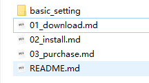

# 下载

官网是：[reaper.fm](https://github.com/ReaperBook/Reabook/tree/eeb033dffcac10aba1bdbf784e40c48b9f0be611/ch1_prepare/reaper.fm) 关于如何下载 REAPER

尝试查看 Gitbook.com（网站编辑器）是如何添加各个内容的：

文章链接：



手动添加一个试试：



提示：


注意：在这里可以添加提示，不知是什么结构。



警告长这样儿


……好吧还挺麻烦的。

{`% page-ref page="01\_download.md" %`} 是引用文章页，目录的话就直接引用文件夹，会识别 README 的；非目录我估计是文件夹/文件名，试试看。

{`% hint style="info" %`}是对应的提示，用这个其实，然后要用{`% endhint %`}结束。 ——挺麻烦的哈？

看看本地的 gitbook 能不能识别这两种表示。

喵的不行，而且还会阻碍 serve 的生成，也就是没办法和 Gitbook-CLI （本地版）兼容。

所以目前看来，应该是：

1. 先在本地（REAPER book 仓库）写好 md 文件；
2. 然后把 clean 后的内容——图片是否要预上传位置，可能可以直接存在对应文件夹里，然后传到 Github 的仓库空间；
3. 在 Gitbook 网站进行二次调整，例如增加 hint 符号、引用文章页面等等。


### 尝试加一个锚点

标题应该自带锚点的，我猜。


```c
code example 1.0

```






REAPER\_test





















```

```







？？？ 这是什么高科技的东西！



什么也没有



$$
a = b
$$


> 引用一段话。


| 表格 |  |
| :--- | :--- |
| 内容 |  |
| 1 |  |
| 2 |  |


[自己尝试引用一个页面](./02_install.md)


